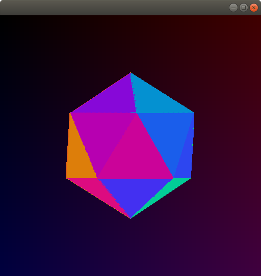
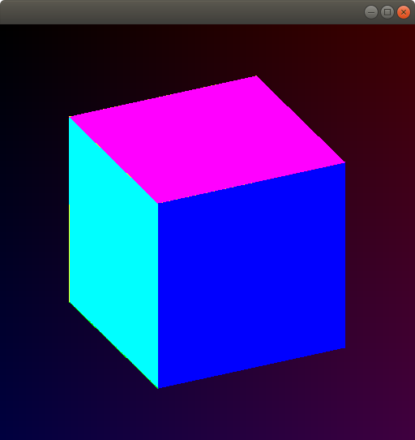
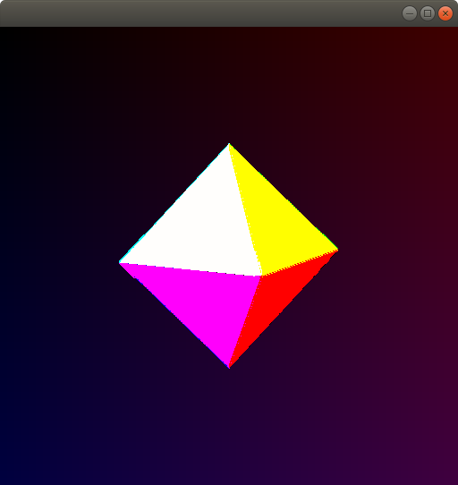
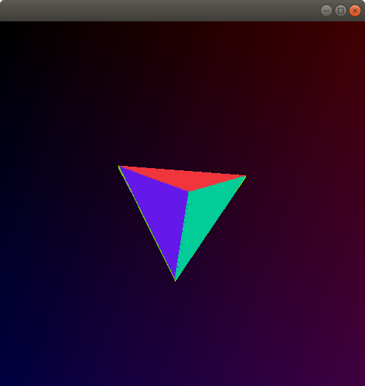
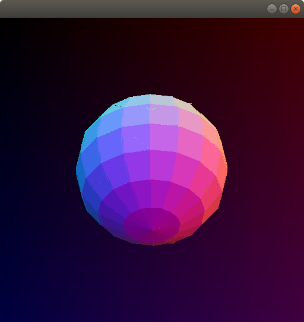

# Cuda Rasterizer

The goal of this project is to rewrite and extend the traditional render pipline using general gpu compute.

## ScreenShots
### Icosahedron

### Cube

### Octahedron

### Tetrahedron

### Sphere
